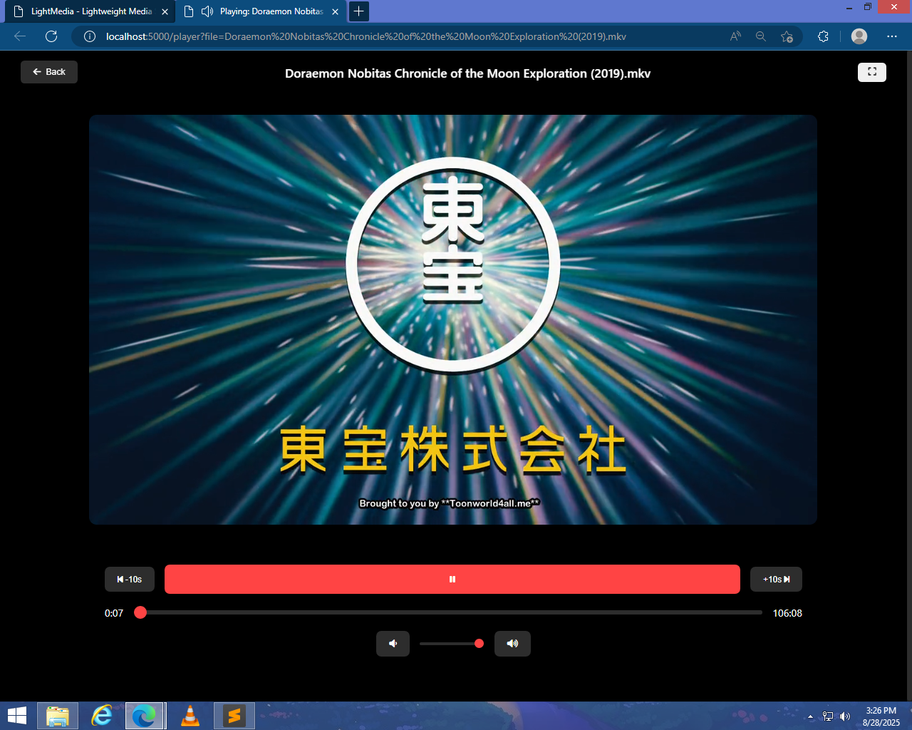
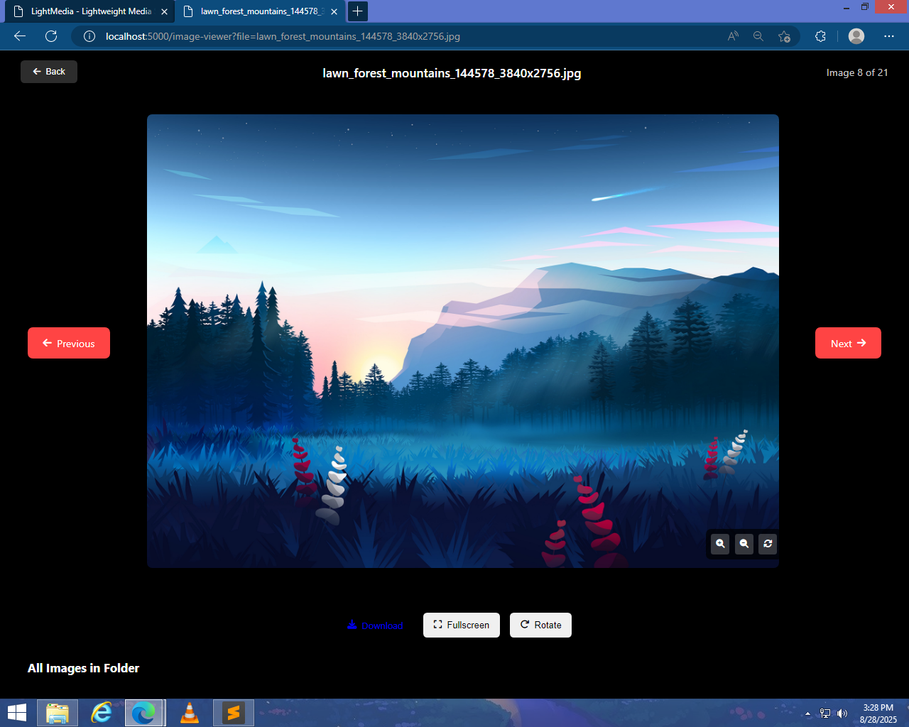

# 📺 LightMedia

**LightMedia** is a lightweight **Flask-based media server** that allows
you to browse, play, and view **videos, music, and images** from your
local machine through a web interface.

Unlike heavy solutions like **Jellyfin**, **Kodi**, or **Plex**,
LightMedia is designed for:\
- 💻 **Low-end PCs or older hardware**\
- ⚡ Users who want a **simple, no-setup media server**\
- 🛠️ People who prefer a minimal, fast, and easy-to-use solution

## 🚀 Features

-   🎬 **Video Player** -- Stream local MP4, MKV, AVI, and more\
-   🎵 **Audio Player** -- Play MP3, WAV, FLAC, etc.\
-   🖼️ **Image Viewer** -- Browse and view images with next/previous
    navigation\
-   📂 **File Browser** -- Navigate folders and subfolders easily\
-   ⚡ Lightweight and fast -- No database needed

## 🛠️ Tech Stack

-   **Backend:** Python (Flask)\
-   **Frontend:** HTML, CSS, JavaScript\
-   **Other:** Jinja2 templates, File system integration

## 📂 Project Structure

    LightMedia/
    │── app.py               # Flask app
    │── templates/           # HTML templates (index, player, image_viewer, browse)
    │── static/              # CSS, JS, icons
    │── media_files/         # Your local media files

## ⚙️ Installation

1.  Clone this repository:

    ``` bash
    git clone https://github.com/Frustrated-Likhon/Light-Media
    cd LightMedia
    ```

2.  Install dependencies:

    ``` bash
    pip install flask werkzeug
    ```

3.  Create a **media_files** folder and add your videos, audio, and
    images:

    ``` bash
    mkdir media_files
    ```

4.  Run the app:

    ``` bash
    python app.py
    ```

5.  Open in your browser:

        http://127.0.0.1:5000

6.  To access from **other devices in the same network**, use your
    **PC's IP address** instead of `127.0.0.1`:

        http://YOUR_PC_IP:5000

    Example: `http://192.168.1.10:5000`

    To change the port, edit the last line of **app.py**:

    ``` python
    if __name__ == '__main__':
        app.run(host='0.0.0.0', port=5000, debug=True)
    ```

    Replace `5000` with your desired port number.

## 🎮 Usage

-   Open the web app and browse files.\
-   Click on a **video** or **audio** file → plays in the built-in
    player.\
-   Click on an **image** → opens in the image viewer with navigation.\
-   Use the **Browse** tab to explore subfolders.


## 📷 Screenshots

### Home Page


### Video Player


### Image Viewer



## 🤝 Contributing

Pull requests are welcome! For major changes, please open an issue first
to discuss what you'd like to change.


